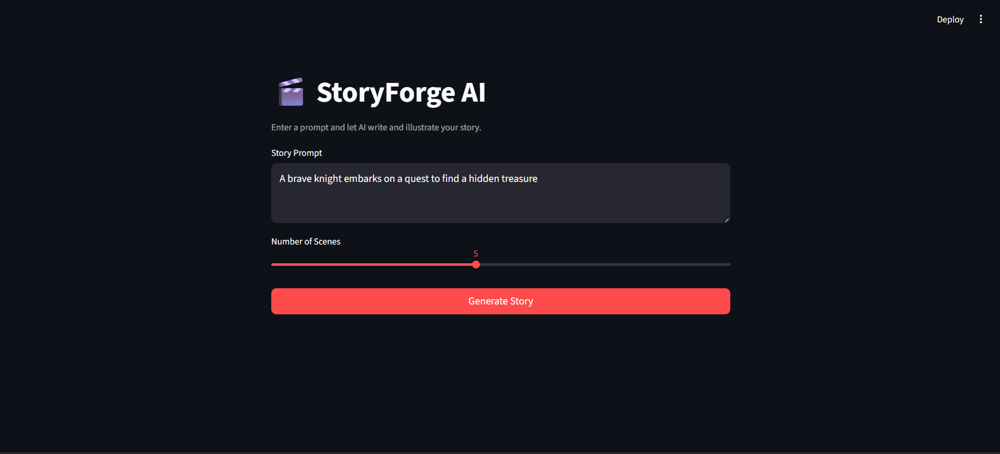
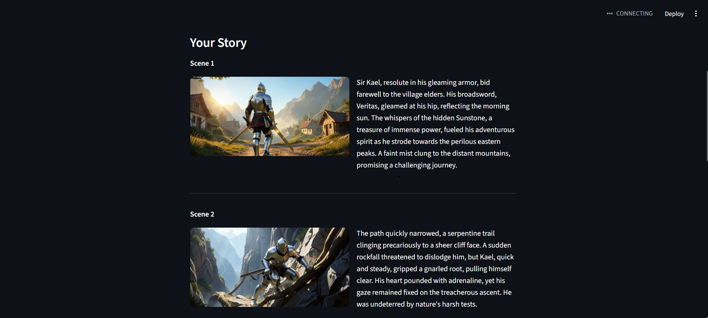

# Agent Story Teller

An AI-powered storytelling system that generates creative stories and corresponding images using Google Gemini and Flux models. Includes a Streamlit web UI for easy interaction.

## Screenshots

**Main Interface**


**Generated Story & Scenes**


---

## Features

- **Story Generation**: Converts user prompts into multi-scene stories using Google Gemini AI
- **Image Generation**: Creates visual representations for each story scene using the Flux model
- **Streamlit Web UI**: Clean browser-based interface — no command line needed
- **Dynamic Scene Control**: Configurable number of scenes (1–10) via a slider
- **Consistent Characters**: Maintains visual consistency across scenes through AI instructions

---

## Project Structure

```
agent-story-teller/
├── agents.py          # Story generation, image prompt, and image generation agents
├── orchestrator.py    # LangGraph workflow orchestration
├── app.py             # Streamlit web UI
├── .env               # API keys (not committed)
├── env/               # Python virtual environment
├── output/            # Generated stories and images (CLI mode only)
│   ├── story.txt
│   └── images/
└── README.md
```

---

## Requirements

- Python 3.10+
- Google Gemini API key
- DeAPI credentials for Flux image generation
- Required packages: `streamlit`, `langgraph`, `google-genai`, `deapi-python-sdk`, `requests`, `python-dotenv`

---

## Installation

1. **Clone or navigate to the project directory**
   ```bash
   cd agent-story-teller
   ```

2. **Create and activate a virtual environment**
   ```bash
   python -m venv env
   source env/bin/activate        # macOS/Linux
   env\Scripts\activate           # Windows
   ```

3. **Install dependencies**
   ```bash
   pip install -r requirements.txt
   ```

4. **Set up environment variables**

   Create a `.env` file in the project root:
   ```
   GOOGLE_API_KEY=your_gemini_api_key
   DEAPI_API_KEY=your_deapi_key
   ```

---

## Usage

### Web UI (recommended)

```bash
streamlit run app.py
```

This opens the app in your browser. Enter a story prompt, choose the number of scenes, and click **Generate Story**.

### Command Line

```bash
python orchestrator.py
```

```
Enter a prompt for the story: A brave knight embarks on a quest to find a hidden treasure
Enter number of scenes to generate (Max= 10): 5
```

Output is saved to the `output/` directory automatically.

---

## Output

| Mode | Story | Images |
|------|-------|--------|
| Web UI | Download via browser button | Download as `.zip` via browser button |
| CLI | `output/story.txt` | `output/images/scene_N.png` |

---

## Configuration

Edit these constants in `orchestrator.py` to adjust behavior:

| Constant | Default | Description |
|----------|---------|-------------|
| `MAX_SCENES` | `10` | Maximum number of scenes allowed |
| `DEFAULT_SCENES` | `5` | Default scene count for CLI mode |

---

## How It Works

```
User Prompt
    │
    ▼
Story Agent  ──(Gemini)──▶  Scene narratives (SCENE_1 … SCENE_N)
    │
    ▼
Image Agent  ──(Gemini)──▶  Visual prompts for each scene
    │
    ▼
Image Generation Tool  ──(Flux)──▶  One image per scene
    │
    ▼
Streamlit UI / CLI  ──▶  Display + Save
```

1. **Story Agent** — Takes the user prompt and generates N scene narratives using Gemini
2. **Image Agent** — Converts each narrative into a self-contained visual prompt using Gemini
3. **Image Generation Tool** — Calls the Flux model via DeAPI to render each prompt as an image
4. **UI / CLI** — Displays the results and provides download options

---

## API Integration

| Service | Purpose |
|---------|---------|
| Google Gemini (`gemini-2.5-flash`) | Story and image prompt generation |
| DeAPI / Flux (`Flux_2_Klein_4B_BF16`) | Image generation from text prompts |
